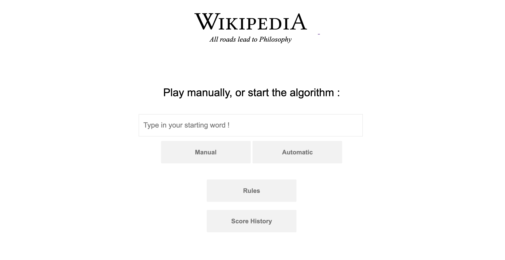

# WebApp

According to ReadWriteWeb, all articles in the English version of Wikipedia lead to the article "Philosophy". If you click on the first link of each article, you will come across the Philosophy article after a while.

In order to verify this assertion, I developped a small WebApp with 2 simple options :
- A manual Wikipedia Link explorer that requests Wikipedia's API
- An automatic exploration that systematically chooses the first link among results

Here are the rules of this game:
- Select start word and validate
- From each word, choose the next word
- If the next word is "Philosophy", then it's won
